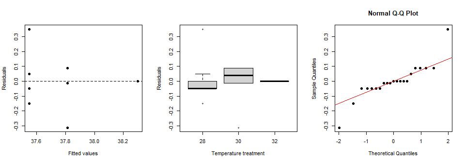
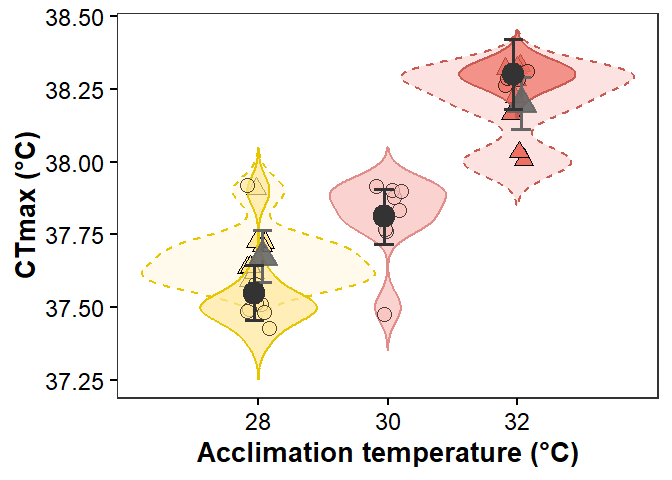

CTmax analysis
================
Hannah von Hammerstein and Sonia Bejarano

- [Overview](#overview)
- [Packages and data](#packages-and-data)
- [Primary analysis: Ramp 1](#primary-analysis-ramp-1)
  - [Model checks](#model-checks)
  - [Treatment estimates](#treatment-estimates)
- [Repeatability: Ramp 1 versus Ramp
  2](#repeatability-ramp-1-versus-ramp-2)
- [Acclimation response ratio](#acclimation-response-ratio)
- [Final CTmax figure](#final-ctmax-figure)
- [Reproducibility information](#reproducibility-information)

# Overview

This document reproduces the CTmax analyses from the cleaned dataset
supplied with this repository. The primary inference uses the first
experimental ramp and compares the three acclimation temperatures (28,
30, and 32 °C). The second ramp, available for the 28 and 32 °C
treatments, is used to assess repeatability.

# Packages and data

``` r
library(dplyr)
library(emmeans)
library(ggplot2)
library(readxl)

data_path <- here::here("Data_CTmaxHist.xlsx")
stopifnot(file.exists(data_path))

ctmax_data <- read_excel(data_path, sheet = "CTmaxHistology")

required_columns <- c(
  "ramp_num", "Temp_Treat", "CTMax", "Histopathology", "C.Temp_Treat"
)
stopifnot(all(required_columns %in% names(ctmax_data)))

temperature_levels <- c("a.ambient.28", "b.medium.30", "c.hot.32")

ctmax_data <- ctmax_data %>%
  mutate(
    ramp_num = factor(ramp_num, levels = c("first", "second")),
    C.Temp_Treat = as.numeric(C.Temp_Treat),
    Temperature_C = factor(C.Temp_Treat, levels = c(28, 30, 32)),
    Temp_Treat = factor(
      case_when(
        C.Temp_Treat == 28 ~ "a.ambient.28",
        C.Temp_Treat == 30 ~ "b.medium.30",
        C.Temp_Treat == 32 ~ "c.hot.32",
        TRUE ~ NA_character_
      ),
      levels = temperature_levels
    )
  )

dplyr::glimpse(ctmax_data)
```

    ## Rows: 37
    ## Columns: 15
    ## $ date                 <chr> "09.01.2023", "09.01.2023", "09.01.2023", "09.01.2023", "09.01.2023", "09.…
    ## $ ramp_num             <fct> first, first, first, first, first, first, first, first, first, first, firs…
    ## $ rec.system           <chr> "RES1", "RES1", "RES1", "RES1", "RES1", "RES1", "RES1", "RES1", "RES6", "R…
    ## $ Temp_Treat           <fct> a.ambient.28, a.ambient.28, a.ambient.28, a.ambient.28, a.ambient.28, a.am…
    ## $ fish.tag             <chr> "red.or.pink", "yellow", "pink", "white", "pink", "blue", "orange", "brown…
    ## $ fishID               <chr> "F1", "F2", "F3", "F4", "F5", "F6", "F7", "F8", "F1", "F2", "F3", "F4", "F…
    ## $ weight.g             <dbl> 14.50, 17.17, 15.69, 13.28, 16.57, 14.79, 15.10, 16.39, 17.48, 23.38, 19.9…
    ## $ TotalL.cm            <dbl> 10.2, 10.2, 9.9, 9.5, 10.4, 9.8, 9.9, 10.2, 10.4, 11.5, 11.0, 10.2, 9.9, 1…
    ## $ StandL.cm            <dbl> 8.1, 8.4, 8.1, 7.7, 8.3, 7.9, 8.1, 8.3, 8.7, 9.6, 9.2, 8.3, 8.0, 8.6, 9.4,…
    ## $ CTMax                <dbl> 37.4, 37.5, 37.5, 37.5, 37.5, 37.5, 37.6, 37.9, 38.3, 38.3, 38.3, 38.3, 38…
    ## $ Label.preserved.fish <chr> "S1.1", "S1.2", "S1.3", "S1.4", "S1.5", "S1.6", "S1.7", "S1.8", "S6.1", "S…
    ## $ Histopathology       <dbl> 1, 0, 1, 0, 0, 0, 1, 1, 1, 1, 1, 0, 1, 1, 0, 0, 1, 1, 1, 1, 1, 1, 1, 1, 0,…
    ## $ Alteration           <chr> "autosysis", NA, "autolysis", NA, NA, NA, "autolysis", "autosysis", "autol…
    ## $ C.Temp_Treat         <dbl> 28, 28, 28, 28, 28, 28, 28, 28, 32, 32, 32, 32, 32, 30, 30, 30, 30, 30, 30…
    ## $ Temperature_C        <fct> 28, 28, 28, 28, 28, 28, 28, 28, 32, 32, 32, 32, 32, 30, 30, 30, 30, 30, 30…

# Primary analysis: Ramp 1

``` r
ramp1_data <- ctmax_data %>%
  filter(ramp_num == "first") %>%
  droplevels()

stopifnot(nlevels(droplevels(ramp1_data$Temperature_C)) == 3)
ctmax_model <- lm(CTMax ~ Temperature_C, data = ramp1_data)

summary(ctmax_model)
```

    ## 
    ## Call:
    ## lm(formula = CTMax ~ Temperature_C, data = ramp1_data)
    ## 
    ## Residuals:
    ##     Min      1Q  Median      3Q     Max 
    ## -0.3125 -0.0500  0.0000  0.0500  0.3500 
    ## 
    ## Coefficients:
    ##                 Estimate Std. Error t value Pr(>|t|)    
    ## (Intercept)     37.55000    0.04478 838.552  < 2e-16 ***
    ## Temperature_C30  0.26250    0.06333   4.145 0.000608 ***
    ## Temperature_C32  0.75000    0.07220  10.387 4.96e-09 ***
    ## ---
    ## Signif. codes:  0 '***' 0.001 '**' 0.01 '*' 0.05 '.' 0.1 ' ' 1
    ## 
    ## Residual standard error: 0.1267 on 18 degrees of freedom
    ## Multiple R-squared:  0.8573, Adjusted R-squared:  0.8414 
    ## F-statistic: 54.05 on 2 and 18 DF,  p-value: 2.46e-08

``` r
anova(ctmax_model)
```

    ## Analysis of Variance Table
    ## 
    ## Response: CTMax
    ##               Df  Sum Sq Mean Sq F value   Pr(>F)    
    ## Temperature_C  2 1.73411 0.86705   54.05 2.46e-08 ***
    ## Residuals     18 0.28875 0.01604                     
    ## ---
    ## Signif. codes:  0 '***' 0.001 '**' 0.01 '*' 0.05 '.' 0.1 ' ' 1

## Model checks

The following diagnostic figures show residuals against fitted values,
residual distributions by acclimation temperature, and the residual
normal Q–Q plot. These are retained because they support the model
checks reported in the manuscript.

``` r
par(mfrow = c(1, 3))

plot(
  fitted(ctmax_model),
  residuals(ctmax_model),
  xlab = "Fitted values",
  ylab = "Residuals",
  pch = 16
)
abline(h = 0, lty = 2)

boxplot(
  residuals(ctmax_model) ~ ramp1_data$Temperature_C,
  xlab = "Temperature treatment",
  ylab = "Residuals"
)

qqnorm(residuals(ctmax_model), pch = 16)
qqline(residuals(ctmax_model), col = "red")
```



``` r
par(mfrow = c(1, 1))
```

``` r
car::leveneTest(CTMax ~ Temperature_C, data = ramp1_data)
```

    ## Levene's Test for Homogeneity of Variance (center = median)
    ##       Df F value Pr(>F)
    ## group  2  1.0852 0.3589
    ##       18

``` r
shapiro.test(residuals(ctmax_model))
```

    ## 
    ##  Shapiro-Wilk normality test
    ## 
    ## data:  residuals(ctmax_model)
    ## W = 0.84515, p-value = 0.003509

``` r
kruskal.test(CTMax ~ Temperature_C, data = ramp1_data)
```

    ## 
    ##  Kruskal-Wallis rank sum test
    ## 
    ## data:  CTMax by Temperature_C
    ## Kruskal-Wallis chi-squared = 14.964, df = 2, p-value = 0.0005631

## Treatment estimates

``` r
ctmax_counts <- ramp1_data %>%
  group_by(Temperature_C, C.Temp_Treat) %>%
  summarise(
    n = n(),
    observed_mean = mean(CTMax, na.rm = TRUE),
    observed_sd = sd(CTMax, na.rm = TRUE),
    .groups = "drop"
  )

ctmax_emmeans <- emmeans(ctmax_model, ~ Temperature_C)
ctmax_emmeans_df <- as.data.frame(ctmax_emmeans) %>%
  mutate(
    C.Temp_Treat = c(28, 30, 32)
  )

ctmax_counts
```

    ## # A tibble: 3 × 5
    ##   Temperature_C C.Temp_Treat     n observed_mean observed_sd
    ##   <fct>                <dbl> <int>         <dbl>       <dbl>
    ## 1 28                      28     8          37.6       0.151
    ## 2 30                      30     8          37.8       0.136
    ## 3 32                      32     5          38.3       0

``` r
ctmax_emmeans_df
```

    ##   Temperature_C  emmean         SE df lower.CL upper.CL C.Temp_Treat
    ## 1            28 37.5500 0.04477955 18 37.45592 37.64408           28
    ## 2            30 37.8125 0.04477955 18 37.71842 37.90658           30
    ## 3            32 38.3000 0.05664215 18 38.18100 38.41900           32

# Repeatability: Ramp 1 versus Ramp 2

The second ramp contains observations from the 28 and 32 °C treatments.
Welch two-sample t-tests compare CTmax between ramps separately within
those two treatments.

``` r
ramp_comparison_data <- ctmax_data %>%
  filter(Temp_Treat %in% c("a.ambient.28", "c.hot.32")) %>%
  droplevels()

ramp_summary <- ramp_comparison_data %>%
  group_by(C.Temp_Treat, ramp_num) %>%
  summarise(
    n = sum(!is.na(CTMax)),
    mean_CTmax = mean(CTMax, na.rm = TRUE),
    sd_CTmax = sd(CTMax, na.rm = TRUE),
    .groups = "drop"
  )

ramp_tests <- lapply(
  split(ramp_comparison_data, ramp_comparison_data$C.Temp_Treat),
  function(x) t.test(CTMax ~ ramp_num, data = x, var.equal = FALSE)
)

ramp_summary
```

    ## # A tibble: 4 × 5
    ##   C.Temp_Treat ramp_num     n mean_CTmax sd_CTmax
    ##          <dbl> <fct>    <int>      <dbl>    <dbl>
    ## 1           28 first        8       37.6    0.151
    ## 2           28 second       8       37.7    0.104
    ## 3           32 first        5       38.3    0    
    ## 4           32 second       8       38.2    0.131

``` r
ramp_tests
```

    ## $`28`
    ## 
    ##  Welch Two Sample t-test
    ## 
    ## data:  CTMax by ramp_num
    ## t = -1.9296, df = 12.38, p-value = 0.07689
    ## alternative hypothesis: true difference in means between group first and group second is not equal to 0
    ## 95 percent confidence interval:
    ##  -0.26566379  0.01566379
    ## sample estimates:
    ##  mean in group first mean in group second 
    ##               37.550               37.675 
    ## 
    ## 
    ## $`32`
    ## 
    ##  Welch Two Sample t-test
    ## 
    ## data:  CTMax by ramp_num
    ## t = 2.1602, df = 7, p-value = 0.06758
    ## alternative hypothesis: true difference in means between group first and group second is not equal to 0
    ## 95 percent confidence interval:
    ##  -0.009460833  0.209460833
    ## sample estimates:
    ##  mean in group first mean in group second 
    ##                 38.3                 38.2

# Acclimation response ratio

The acclimation response ratio (ARR) is the model-estimated change in
CTmax divided by the corresponding change in acclimation temperature:

$$
ARR = \frac{\Delta CTmax}{\Delta T_{acclimation}}
$$

``` r
arr_contrasts <- contrast(
  ctmax_emmeans,
  method = list(
    "30_vs_28" = c(-1, 1, 0),
    "32_vs_28" = c(-1, 0, 1),
    "32_vs_30" = c(0, -1, 1)
  )
)

arr_results <- confint(arr_contrasts, adjust = "none") %>%
  as.data.frame() %>%
  mutate(
    comparison = recode(
      contrast,
      "30_vs_28" = "30 C vs 28 C",
      "32_vs_28" = "32 C vs 28 C",
      "32_vs_30" = "32 C vs 30 C"
    ),
    delta_Tacc_C = recode(
      contrast,
      "30_vs_28" = 2,
      "32_vs_28" = 4,
      "32_vs_30" = 2
    ),
    delta_CTmax_C = estimate,
    lower_delta_CTmax_C = lower.CL,
    upper_delta_CTmax_C = upper.CL,
    ARR = delta_CTmax_C / delta_Tacc_C,
    ARR_lower_95_CI = lower_delta_CTmax_C / delta_Tacc_C,
    ARR_upper_95_CI = upper_delta_CTmax_C / delta_Tacc_C
  ) %>%
  dplyr::select(
    comparison,
    delta_Tacc_C,
    delta_CTmax_C,
    lower_delta_CTmax_C,
    upper_delta_CTmax_C,
    ARR,
    ARR_lower_95_CI,
    ARR_upper_95_CI
  ) %>%
  mutate(across(where(is.numeric), ~ round(.x, 3)))

arr_results
```

    ##     comparison delta_Tacc_C delta_CTmax_C lower_delta_CTmax_C upper_delta_CTmax_C   ARR ARR_lower_95_CI
    ## 1 30 C vs 28 C            2         0.262               0.129               0.396 0.131           0.065
    ## 2 32 C vs 28 C            4         0.750               0.598               0.902 0.187           0.150
    ## 3 32 C vs 30 C            2         0.487               0.336               0.639 0.244           0.168
    ##   ARR_upper_95_CI
    ## 1           0.198
    ## 2           0.225
    ## 3           0.320

``` r
write.csv(
  arr_results,
  here::here("results", "CTmax_ARR_results.csv"),
  row.names = FALSE
)
```

# Final CTmax figure

This is the only CTmax figure printed in the rendered analysis. Circles
and solid estimates represent Ramp 1; triangles and dashed estimates
represent Ramp 2. Ramp 2 was conducted only at 28 and 32 °C.

``` r
ramp2_data <- ctmax_data %>%
  filter(ramp_num == "second") %>%
  droplevels()

ramp2_model <- lm(CTMax ~ Temperature_C, data = ramp2_data)

ramp2_emmeans_df <- emmeans(ramp2_model, ~ Temperature_C) %>%
  as.data.frame() %>%
  mutate(C.Temp_Treat = c(28, 32))

temp_fill <- c(
  "a.ambient.28" = "#ffe79a",
  "b.medium.30" = "#f8c0bb",
  "c.hot.32" = "#ee7063"
)

temp_colour <- c(
  "a.ambient.28" = "#E6C600",
  "b.medium.30" = "#E18E8B",
  "c.hot.32" = "#C85B52"
)

p_ctmax_final <- ggplot() +
  geom_violin(
    data = filter(ctmax_data, ramp_num == "second"),
    aes(C.Temp_Treat, CTMax, fill = Temp_Treat, colour = Temp_Treat),
    trim = FALSE,
    bw = 0.05,
    alpha = 0.2,
    scale = "width",
    linetype = "dashed",
    show.legend = FALSE
  ) +
  geom_jitter(
    data = filter(ctmax_data, ramp_num == "second"),
    aes(C.Temp_Treat, CTMax, fill = Temp_Treat),
    shape = 24,
    size = 4.5,
    colour = "black",
    width = 0.2
  ) +
  geom_violin(
    data = filter(ctmax_data, ramp_num == "first"),
    aes(C.Temp_Treat, CTMax, fill = Temp_Treat, colour = Temp_Treat),
    trim = FALSE,
    bw = 0.05,
    alpha = 0.7,
    scale = "width",
    show.legend = FALSE
  ) +
  geom_jitter(
    data = filter(ctmax_data, ramp_num == "first"),
    aes(C.Temp_Treat, CTMax, fill = Temp_Treat),
    shape = 21,
    size = 4.5,
    colour = "black",
    alpha = 0.7,
    width = 0.2
  ) +
  geom_errorbar(
    data = ramp2_emmeans_df,
    aes(C.Temp_Treat, ymin = lower.CL, ymax = upper.CL),
    width = 0.30,
    linewidth = 1.3,
    linetype = "longdash",
    colour = "grey40",
    position = position_nudge(x = 0.06)
  ) +
  geom_point(
    data = ramp2_emmeans_df,
    aes(C.Temp_Treat, emmean),
    shape = 24,
    size = 6.8,
    stroke = 1.15,
    alpha = 0.9,
    fill = "grey40",
    colour = "grey40",
    position = position_nudge(x = 0.06)
  ) +
  geom_errorbar(
    data = ctmax_emmeans_df,
    aes(C.Temp_Treat, ymin = lower.CL, ymax = upper.CL),
    width = 0.30,
    linewidth = 1.3,
    colour = "grey20",
    position = position_nudge(x = -0.06)
  ) +
  geom_point(
    data = ctmax_emmeans_df,
    aes(C.Temp_Treat, emmean),
    shape = 21,
    size = 7,
    stroke = 1.15,
    fill = "grey20",
    colour = "grey20",
    position = position_nudge(x = -0.06)
  ) +
  scale_x_continuous(breaks = c(28, 30, 32)) +
  scale_fill_manual(values = temp_fill) +
  scale_colour_manual(values = temp_colour) +
  labs(
    x = "Acclimation temperature (°C)",
    y = "CTmax (°C)"
  ) +
  theme_bw(base_size = 20) +
  theme(
    panel.border = element_rect(linetype = "solid", fill = NA),
    panel.grid.major = element_blank(),
    panel.grid.minor = element_blank(),
    axis.text = element_text(colour = "black", size = 18),
    axis.ticks = element_line(linewidth = 1, colour = "black"),
    axis.ticks.length = grid::unit(0.2, "cm"),
    axis.title = element_text(face = "bold", size = 20),
    plot.caption = element_text(size = 14, hjust = 0.5, face = "italic"),
    legend.position = "none"
  )

p_ctmax_final
```

<div class="figure" style="text-align: center">


<p class="caption">
CTmax by acclimation temperature and experimental ramp.
</p>

</div>

``` r
ggsave(
  here::here("figures", "CTmax_combined_ramps.pdf"),
  p_ctmax_final,
  width = 4.5,
  height = 3.5,
  units = "in",
  scale = 2.5
)

ggsave(
  here::here("figures", "CTmax_combined_ramps.png"),
  p_ctmax_final,
  width = 4.5,
  height = 3.5,
  units = "in",
  scale = 2.5,
  dpi = 600
)
```

# Reproducibility information

``` r
sessionInfo()
```

    ## R version 4.4.0 (2024-04-24 ucrt)
    ## Platform: x86_64-w64-mingw32/x64
    ## Running under: Windows 11 x64 (build 26200)
    ## 
    ## Matrix products: default
    ## 
    ## 
    ## locale:
    ## [1] LC_COLLATE=English_United States.utf8  LC_CTYPE=English_United States.utf8   
    ## [3] LC_MONETARY=English_United States.utf8 LC_NUMERIC=C                          
    ## [5] LC_TIME=English_United States.utf8    
    ## 
    ## time zone: Europe/Berlin
    ## tzcode source: internal
    ## 
    ## attached base packages:
    ## [1] stats     graphics  grDevices utils     datasets  methods   base     
    ## 
    ## other attached packages:
    ## [1] readxl_1.4.3   ggplot2_4.0.1  emmeans_1.11.0 dplyr_1.2.1   
    ## 
    ## loaded via a namespace (and not attached):
    ##  [1] sandwich_3.1-0     utf8_1.2.4         generics_0.1.3     lattice_0.22-6     digest_0.6.35     
    ##  [6] magrittr_2.0.3     evaluate_0.23      grid_4.4.0         estimability_1.5.1 RColorBrewer_1.1-3
    ## [11] mvtnorm_1.2-5      fastmap_1.2.0      cellranger_1.1.0   rprojroot_2.0.4    Matrix_1.7-0      
    ## [16] Formula_1.2-5      survival_3.5-8     multcomp_1.4-25    fansi_1.0.6        scales_1.4.0      
    ## [21] TH.data_1.1-2      textshaping_0.3.7  codetools_0.2-20   abind_1.4-5        cli_3.6.2         
    ## [26] rlang_1.3.0        splines_4.4.0      withr_3.0.0        yaml_2.3.8         otel_0.2.0        
    ## [31] tools_4.4.0        coda_0.19-4.1      here_1.0.1         vctrs_0.7.3        R6_2.5.1          
    ## [36] zoo_1.8-12         lifecycle_1.0.5    car_3.1-5          MASS_7.3-60.2      ragg_1.3.2        
    ## [41] pkgconfig_2.0.3    pillar_1.9.0       gtable_0.3.6       glue_1.7.0         systemfonts_1.0.6 
    ## [46] xfun_0.60          tibble_3.2.1       tidyselect_1.2.1   rstudioapi_0.16.0  knitr_1.51        
    ## [51] farver_2.1.2       xtable_1.8-4       htmltools_0.5.8.1  labeling_0.4.3     rmarkdown_2.31    
    ## [56] carData_3.0-5      compiler_4.4.0     S7_0.2.1
