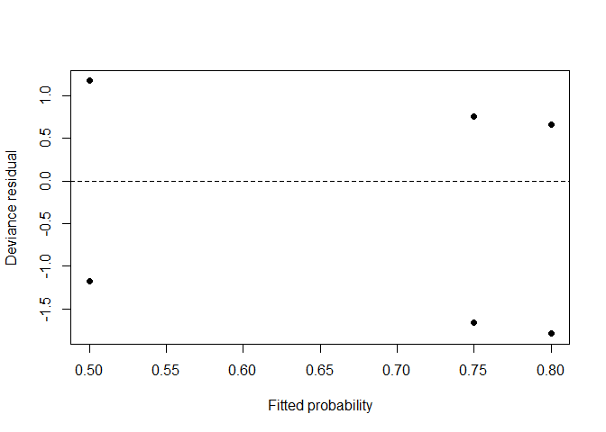
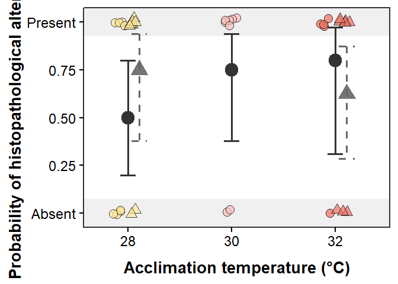

Histopathology analysis
================
Hannah von Hammerstein and Sonia Bejarano

- [Overview](#overview)
- [Packages and data](#packages-and-data)
- [Primary analysis: Ramp 1](#primary-analysis-ramp-1)
  - [Model comparison and checks](#model-comparison-and-checks)
  - [Observed and model-estimated
    probabilities](#observed-and-model-estimated-probabilities)
  - [Odds ratios](#odds-ratios)
- [Repeatability: Ramp 1 versus Ramp
  2](#repeatability-ramp-1-versus-ramp-2)
- [Ramp 2 model](#ramp-2-model)
- [Final histopathology figure](#final-histopathology-figure)
- [Reproducibility information](#reproducibility-information)

# Overview

This document reproduces the histopathology analyses from the cleaned
dataset supplied with this repository. Histopathology is coded as a
binary response (0 = no alteration detected; 1 = alteration detected).
The primary analysis uses the first experimental ramp and tests whether
alteration probability differs among the 28, 30, and 32 °C acclimation
treatments. The second ramp, available at 28 and 32 °C, is used to
assess repeatability.

# Packages and data

``` r
library(dplyr)
library(emmeans)
library(ggplot2)
library(readxl)

data_path <- here::here("Data_CTmaxHist.xlsx")
stopifnot(file.exists(data_path))

histo_data <- read_excel(data_path, sheet = "CTmaxHistology")

required_columns <- c(
  "ramp_num", "Temp_Treat", "Histopathology", "C.Temp_Treat"
)
stopifnot(all(required_columns %in% names(histo_data)))

temperature_levels <- c("a.ambient.28", "b.medium.30", "c.hot.32")

histo_data <- histo_data %>%
  mutate(
    ramp_num = factor(ramp_num, levels = c("first", "second")),
    C.Temp_Treat = as.numeric(C.Temp_Treat),
    Temperature_C = factor(C.Temp_Treat, levels = c(28, 30, 32)),
    Temp_Treat = factor(
      case_when(
        C.Temp_Treat == 28 ~ "a.ambient.28",
        C.Temp_Treat == 30 ~ "b.medium.30",
        C.Temp_Treat == 32 ~ "c.hot.32",
        TRUE ~ NA_character_
      ),
      levels = temperature_levels
    ),
    Histopathology = as.integer(Histopathology)
  )

stopifnot(all(na.omit(histo_data$Histopathology) %in% c(0L, 1L)))
dplyr::glimpse(histo_data)
```

    ## Rows: 37
    ## Columns: 15
    ## $ date                 <chr> "09.01.2023", "09.01.2023", "09.01.2023", "09.01.2023", "09.01.2023", "09.…
    ## $ ramp_num             <fct> first, first, first, first, first, first, first, first, first, first, firs…
    ## $ rec.system           <chr> "RES1", "RES1", "RES1", "RES1", "RES1", "RES1", "RES1", "RES1", "RES6", "R…
    ## $ Temp_Treat           <fct> a.ambient.28, a.ambient.28, a.ambient.28, a.ambient.28, a.ambient.28, a.am…
    ## $ fish.tag             <chr> "red.or.pink", "yellow", "pink", "white", "pink", "blue", "orange", "brown…
    ## $ fishID               <chr> "F1", "F2", "F3", "F4", "F5", "F6", "F7", "F8", "F1", "F2", "F3", "F4", "F…
    ## $ weight.g             <dbl> 14.50, 17.17, 15.69, 13.28, 16.57, 14.79, 15.10, 16.39, 17.48, 23.38, 19.9…
    ## $ TotalL.cm            <dbl> 10.2, 10.2, 9.9, 9.5, 10.4, 9.8, 9.9, 10.2, 10.4, 11.5, 11.0, 10.2, 9.9, 1…
    ## $ StandL.cm            <dbl> 8.1, 8.4, 8.1, 7.7, 8.3, 7.9, 8.1, 8.3, 8.7, 9.6, 9.2, 8.3, 8.0, 8.6, 9.4,…
    ## $ CTMax                <dbl> 37.4, 37.5, 37.5, 37.5, 37.5, 37.5, 37.6, 37.9, 38.3, 38.3, 38.3, 38.3, 38…
    ## $ Label.preserved.fish <chr> "S1.1", "S1.2", "S1.3", "S1.4", "S1.5", "S1.6", "S1.7", "S1.8", "S6.1", "S…
    ## $ Histopathology       <int> 1, 0, 1, 0, 0, 0, 1, 1, 1, 1, 1, 0, 1, 1, 0, 0, 1, 1, 1, 1, 1, 1, 1, 1, 0,…
    ## $ Alteration           <chr> "autosysis", NA, "autolysis", NA, NA, NA, "autolysis", "autosysis", "autol…
    ## $ C.Temp_Treat         <dbl> 28, 28, 28, 28, 28, 28, 28, 28, 32, 32, 32, 32, 32, 30, 30, 30, 30, 30, 30…
    ## $ Temperature_C        <fct> 28, 28, 28, 28, 28, 28, 28, 28, 32, 32, 32, 32, 32, 30, 30, 30, 30, 30, 30…

# Primary analysis: Ramp 1

A binomial logistic regression estimates histopathological alteration
probability as a function of categorical acclimation temperature.

``` r
ramp1_data <- histo_data %>%
  filter(ramp_num == "first") %>%
  droplevels()

stopifnot(nlevels(droplevels(ramp1_data$Temperature_C)) == 3)

histo_model <- glm(
  Histopathology ~ Temperature_C,
  data = ramp1_data,
  family = binomial(link = "logit")
)

histo_null_model <- glm(
  Histopathology ~ 1,
  data = ramp1_data,
  family = binomial(link = "logit")
)

summary(histo_model)
```

    ## 
    ## Call:
    ## glm(formula = Histopathology ~ Temperature_C, family = binomial(link = "logit"), 
    ##     data = ramp1_data)
    ## 
    ## Coefficients:
    ##                  Estimate Std. Error z value Pr(>|z|)
    ## (Intercept)     2.677e-16  7.071e-01   0.000    1.000
    ## Temperature_C30 1.099e+00  1.080e+00   1.017    0.309
    ## Temperature_C32 1.386e+00  1.323e+00   1.048    0.295
    ## 
    ## (Dispersion parameter for binomial family taken to be 1)
    ## 
    ##     Null deviance: 26.734  on 20  degrees of freedom
    ## Residual deviance: 25.092  on 18  degrees of freedom
    ## AIC: 31.092
    ## 
    ## Number of Fisher Scoring iterations: 4

## Model comparison and checks

The likelihood-ratio test compares the temperature model with an
intercept-only model. The residual deviance divided by residual degrees
of freedom is reported as a simple overdispersion diagnostic.

``` r
aic_table <- AIC(histo_null_model, histo_model)
aic_table$delta_AIC <- aic_table$AIC - min(aic_table$AIC)

likelihood_ratio_test <- anova(
  histo_null_model,
  histo_model,
  test = "Chisq"
)

dispersion_ratio <- deviance(histo_model) / df.residual(histo_model)

aic_table
```

    ##                  df      AIC delta_AIC
    ## histo_null_model  1 28.73360  0.000000
    ## histo_model       3 31.09174  2.358146

``` r
likelihood_ratio_test
```

    ## Analysis of Deviance Table
    ## 
    ## Model 1: Histopathology ~ 1
    ## Model 2: Histopathology ~ Temperature_C
    ##   Resid. Df Resid. Dev Df Deviance Pr(>Chi)
    ## 1        20     26.734                     
    ## 2        18     25.092  2   1.6419     0.44

``` r
dispersion_ratio
```

    ## [1] 1.393986

The diagnostic plot is retained because it supports the model assessment
reported in the manuscript.

``` r
plot(
  fitted(histo_model),
  residuals(histo_model, type = "deviance"),
  xlab = "Fitted probability",
  ylab = "Deviance residual",
  pch = 16
)
abline(h = 0, lty = 2)
```



## Observed and model-estimated probabilities

``` r
histo_counts_ramp1 <- ramp1_data %>%
  group_by(Temperature_C, C.Temp_Treat) %>%
  summarise(
    n = n(),
    alterations = sum(Histopathology, na.rm = TRUE),
    observed_probability = mean(Histopathology, na.rm = TRUE),
    .groups = "drop"
  )

histo_emmeans_ramp1 <- emmeans(
  histo_model,
  ~ Temperature_C,
  type = "response"
)

histo_probabilities_ramp1 <- as.data.frame(histo_emmeans_ramp1) %>%
  mutate(C.Temp_Treat = c(28, 30, 32)) %>%
  rename(
    predicted_probability = prob,
    lower_95_CI = asymp.LCL,
    upper_95_CI = asymp.UCL
  ) %>%
  left_join(histo_counts_ramp1, by = c("Temperature_C", "C.Temp_Treat")) %>%
  arrange(C.Temp_Treat) %>%
  mutate(
    across(
      c(observed_probability, predicted_probability, lower_95_CI, upper_95_CI),
      ~ round(.x, 3)
    )
  ) %>%
  dplyr::select(
    Temperature_C,
    C.Temp_Treat,
    n,
    alterations,
    observed_probability,
    predicted_probability,
    lower_95_CI,
    upper_95_CI
  )

histo_probabilities_ramp1
```

    ##   Temperature_C C.Temp_Treat n alterations observed_probability predicted_probability lower_95_CI
    ## 1            28           28 8           4                 0.50                  0.50       0.200
    ## 2            30           30 8           6                 0.75                  0.75       0.377
    ## 3            32           32 5           4                 0.80                  0.80       0.309
    ##   upper_95_CI
    ## 1       0.800
    ## 2       0.937
    ## 3       0.973

``` r
write.csv(
  histo_probabilities_ramp1,
  here::here("results", "Histopathology_Ramp1_probabilities.csv"),
  row.names = FALSE
)
```

## Odds ratios

``` r
odds_ratios <- data.frame(
  term = names(coef(histo_model)),
  odds_ratio = exp(coef(histo_model)),
  exp(confint(histo_model)),
  check.names = FALSE
)

odds_ratios
```

    ##                            term odds_ratio     2.5 %    97.5 %
    ## (Intercept)         (Intercept)          1 0.2364472  4.229273
    ## Temperature_C30 Temperature_C30          3 0.3844160 30.467897
    ## Temperature_C32 Temperature_C32          4 0.3640238 98.900974

# Repeatability: Ramp 1 versus Ramp 2

Fisher’s exact tests compare the frequency of histopathological
alterations between ramps separately at 28 and 32 °C.

``` r
ramp_comparison_data <- histo_data %>%
  filter(Temp_Treat %in% c("a.ambient.28", "c.hot.32")) %>%
  droplevels()

ramp_tables <- lapply(
  split(ramp_comparison_data, ramp_comparison_data$C.Temp_Treat),
  function(x) table(ramp = x$ramp_num, alteration = x$Histopathology)
)

ramp_fisher_tests <- lapply(ramp_tables, fisher.test)

ramp_tables
```

    ## $`28`
    ##         alteration
    ## ramp     0 1
    ##   first  4 4
    ##   second 2 6
    ## 
    ## $`32`
    ##         alteration
    ## ramp     0 1
    ##   first  1 4
    ##   second 3 5

``` r
ramp_fisher_tests
```

    ## $`28`
    ## 
    ##  Fisher's Exact Test for Count Data
    ## 
    ## data:  X[[i]]
    ## p-value = 0.6084
    ## alternative hypothesis: true odds ratio is not equal to 1
    ## 95 percent confidence interval:
    ##   0.2485664 45.7630284
    ## sample estimates:
    ## odds ratio 
    ##    2.79346 
    ## 
    ## 
    ## $`32`
    ## 
    ##  Fisher's Exact Test for Count Data
    ## 
    ## data:  X[[i]]
    ## p-value = 1
    ## alternative hypothesis: true odds ratio is not equal to 1
    ## 95 percent confidence interval:
    ##  0.006377198 8.505418914
    ## sample estimates:
    ## odds ratio 
    ##  0.4446127

# Ramp 2 model

The second-ramp model is a sensitivity analysis restricted to the two
temperatures represented in that ramp.

``` r
ramp2_data <- histo_data %>%
  filter(ramp_num == "second") %>%
  droplevels()

histo_model_ramp2 <- glm(
  Histopathology ~ Temperature_C,
  data = ramp2_data,
  family = binomial(link = "logit")
)

histo_null_model_ramp2 <- glm(
  Histopathology ~ 1,
  data = ramp2_data,
  family = binomial(link = "logit")
)

anova(histo_null_model_ramp2, histo_model_ramp2, test = "Chisq")
```

    ## Analysis of Deviance Table
    ## 
    ## Model 1: Histopathology ~ 1
    ## Model 2: Histopathology ~ Temperature_C
    ##   Resid. Df Resid. Dev Df Deviance Pr(>Chi)
    ## 1        15     19.875                     
    ## 2        14     19.582  1  0.29239   0.5887

``` r
summary(histo_model_ramp2)
```

    ## 
    ## Call:
    ## glm(formula = Histopathology ~ Temperature_C, family = binomial(link = "logit"), 
    ##     data = ramp2_data)
    ## 
    ## Coefficients:
    ##                 Estimate Std. Error z value Pr(>|z|)
    ## (Intercept)       1.0986     0.8165   1.346    0.178
    ## Temperature_C32  -0.5878     1.0954  -0.537    0.592
    ## 
    ## (Dispersion parameter for binomial family taken to be 1)
    ## 
    ##     Null deviance: 19.875  on 15  degrees of freedom
    ## Residual deviance: 19.582  on 14  degrees of freedom
    ## AIC: 23.582
    ## 
    ## Number of Fisher Scoring iterations: 4

# Final histopathology figure

This is the only histopathology figure printed in the rendered analysis.
Raw binary outcomes are shown at 0 (absent) and 1 (present). Circles and
solid estimates represent Ramp 1; triangles and dashed estimates
represent Ramp 2. No line is drawn between categorical treatment
estimates.

``` r
histo_emmeans_ramp1_df <- as.data.frame(histo_emmeans_ramp1) %>%
  mutate(C.Temp_Treat = c(28, 30, 32))

histo_emmeans_ramp2_df <- emmeans(
  histo_model_ramp2,
  ~ Temperature_C,
  type = "response"
) %>%
  as.data.frame() %>%
  mutate(
    C.Temp_Treat = c(28, 32),
    x_plot = C.Temp_Treat + 0.22
  )

plot_data <- histo_data %>%
  mutate(
    x_plot = C.Temp_Treat + case_when(
      Temp_Treat == "b.medium.30" ~ 0,
      ramp_num == "first" ~ -0.16,
      ramp_num == "second" ~ 0.16,
      TRUE ~ 0
    )
  )

temp_fill <- c(
  "a.ambient.28" = "#ffe79a",
  "b.medium.30" = "#f8c0bb",
  "c.hot.32" = "#ee7063"
)

temp_colour <- c(
  "a.ambient.28" = "#E6C600",
  "b.medium.30" = "#E18E8B",
  "c.hot.32" = "#C85B52"
)

p_histo_final <- ggplot() +
  annotate(
    "rect",
    xmin = -Inf,
    xmax = Inf,
    ymin = -0.075,
    ymax = 0.075,
    fill = "grey94",
    colour = NA
  ) +
  annotate(
    "rect",
    xmin = -Inf,
    xmax = Inf,
    ymin = 0.925,
    ymax = 1.075,
    fill = "grey94",
    colour = NA
  ) +
  geom_point(
    data = plot_data,
    aes(x_plot, Histopathology, fill = Temp_Treat, shape = ramp_num),
    position = position_jitter(width = 0.13, height = 0.022, seed = 2026),
    size = 4.5,
    colour = "black",
    alpha = 0.7
  ) +
  geom_errorbar(
    data = histo_emmeans_ramp2_df,
    aes(x_plot, ymin = asymp.LCL, ymax = asymp.UCL),
    width = 0.30,
    linewidth = 1.3,
    linetype = "dashed",
    colour = "grey40"
  ) +
  geom_point(
    data = histo_emmeans_ramp2_df,
    aes(x_plot, prob),
    shape = 24,
    size = 6.8,
    stroke = 1,
    alpha = 0.9,
    fill = "grey40",
    colour = "grey40"
  ) +
  geom_errorbar(
    data = histo_emmeans_ramp1_df,
    aes(C.Temp_Treat, ymin = asymp.LCL, ymax = asymp.UCL),
    width = 0.30,
    linewidth = 1.3,
    colour = "grey20"
  ) +
  geom_point(
    data = histo_emmeans_ramp1_df,
    aes(C.Temp_Treat, prob),
    shape = 21,
    size = 7,
    stroke = 1.15,
    fill = "grey20",
    colour = "grey20"
  ) +
  scale_x_continuous(
    breaks = c(28, 30, 32),
    expand = expansion(mult = c(0.08, 0.10))
  ) +
  scale_y_continuous(
    breaks = c(0, 0.25, 0.5, 0.75, 1),
    labels = c("Absent", "0.25", "0.50", "0.75", "Present"),
    expand = expansion(mult = c(0, 0))
  ) +
  scale_fill_manual(values = temp_fill, guide = "none") +
  scale_colour_manual(values = temp_colour, guide = "none") +
  scale_shape_manual(
    values = c("first" = 21, "second" = 24),
    labels = c("Ramp 1", "Ramp 2"),
    name = NULL
  ) +
  coord_cartesian(
    xlim = c(27.55, 32.55),
    ylim = c(-0.075, 1.075),
    clip = "off"
  ) +
  labs(
    x = "Acclimation temperature (°C)",
    y = "Probability of histopathological alteration"
  ) +
  guides(
    shape = guide_legend(
      override.aes = list(
        fill = "grey75",
        colour = "grey25",
        alpha = 1,
        size = 3.2
      )
    )
  ) +
  theme_bw(base_size = 20) +
  theme(
    panel.border = element_rect(linetype = "solid", fill = NA),
    panel.grid.major.x = element_blank(),
    panel.grid.major.y = element_blank(),
    panel.grid.minor = element_blank(),
    axis.text = element_text(colour = "black", size = 18),
    axis.ticks = element_line(linewidth = 1, colour = "black"),
    axis.ticks.length = grid::unit(0.2, "cm"),
    axis.title = element_text(face = "bold", size = 20),
    axis.title.x = element_text(margin = margin(t = 15)),
    legend.position = "none"
  )

p_histo_final
```

<div class="figure" style="text-align: center">


<p class="caption">
Histopathological alteration outcomes and model-estimated probabilities
by acclimation temperature and ramp.
</p>

</div>

``` r
ggsave(
  here::here("figures", "Histopathology_combined_ramps.pdf"),
  p_histo_final,
  width = 4.5,
  height = 3.3,
  units = "in",
  scale = 2.5
)

ggsave(
  here::here("figures", "Histopathology_combined_ramps.png"),
  p_histo_final,
  width = 4.5,
  height = 3.3,
  units = "in",
  scale = 2.5,
  dpi = 600
)
```

# Reproducibility information

``` r
sessionInfo()
```

    ## R version 4.4.0 (2024-04-24 ucrt)
    ## Platform: x86_64-w64-mingw32/x64
    ## Running under: Windows 11 x64 (build 26200)
    ## 
    ## Matrix products: default
    ## 
    ## 
    ## locale:
    ## [1] LC_COLLATE=English_United States.utf8  LC_CTYPE=English_United States.utf8   
    ## [3] LC_MONETARY=English_United States.utf8 LC_NUMERIC=C                          
    ## [5] LC_TIME=English_United States.utf8    
    ## 
    ## time zone: Europe/Berlin
    ## tzcode source: internal
    ## 
    ## attached base packages:
    ## [1] stats     graphics  grDevices utils     datasets  methods   base     
    ## 
    ## other attached packages:
    ## [1] readxl_1.4.3   ggplot2_4.0.1  emmeans_1.11.0 dplyr_1.2.1   
    ## 
    ## loaded via a namespace (and not attached):
    ##  [1] sandwich_3.1-0     utf8_1.2.4         generics_0.1.3     lattice_0.22-6     digest_0.6.35     
    ##  [6] magrittr_2.0.3     evaluate_0.23      grid_4.4.0         estimability_1.5.1 RColorBrewer_1.1-3
    ## [11] mvtnorm_1.2-5      fastmap_1.2.0      cellranger_1.1.0   rprojroot_2.0.4    Matrix_1.7-0      
    ## [16] Formula_1.2-5      survival_3.5-8     multcomp_1.4-25    fansi_1.0.6        scales_1.4.0      
    ## [21] TH.data_1.1-2      textshaping_0.3.7  codetools_0.2-20   abind_1.4-5        cli_3.6.2         
    ## [26] rlang_1.3.0        splines_4.4.0      withr_3.0.0        yaml_2.3.8         otel_0.2.0        
    ## [31] tools_4.4.0        coda_0.19-4.1      here_1.0.1         vctrs_0.7.3        R6_2.5.1          
    ## [36] zoo_1.8-12         lifecycle_1.0.5    car_3.1-5          MASS_7.3-60.2      ragg_1.3.2        
    ## [41] pkgconfig_2.0.3    pillar_1.9.0       gtable_0.3.6       glue_1.7.0         systemfonts_1.0.6 
    ## [46] xfun_0.60          tibble_3.2.1       tidyselect_1.2.1   rstudioapi_0.16.0  knitr_1.51        
    ## [51] farver_2.1.2       xtable_1.8-4       htmltools_0.5.8.1  labeling_0.4.3     rmarkdown_2.31    
    ## [56] carData_3.0-5      compiler_4.4.0     S7_0.2.1
