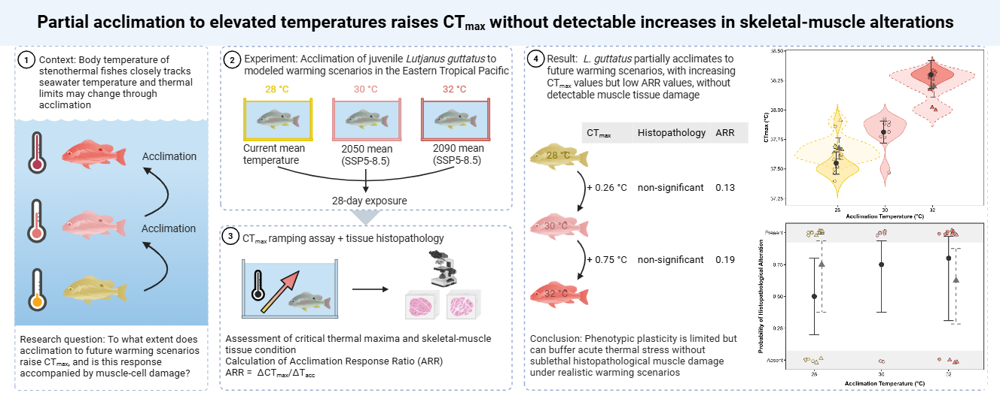

## Acclimation to elevated temperatures raises critical thermal maxima (CTmax) without detectable increases in skeletal-muscle histopathological alterations in Lutjanus guttatus
Data and R Scripts for the publication "Acclimation to elevated temperatures raises critical thermal maxima (CTmax) without detectable increases in skeletal-muscle histopathological alterations in Lutjanus guttatus"

Publication link: {}
DOI: {}

##### Hannah von Hammerstein a,b*, Carla Martins c,d, Carolina Madeira c,d, Nikol Avila-Cerdas e, Jakob Bornhaeuser a,c,d,f, Elman Calvo Elizondo e,g, Jonathan Chacon Guzman e,g, Pedro M. Costa c,d, Chiara De Falco h,i, Guillermo Diaz-Pulido j, Mario Diniz d,k, Tyrone Estmann a,l, Emmanuel Esquivel e, Priscilla Mooney h, Jose Gabriel Rodriguez-Trejos e, Stefanie Schwerdt a,m, Jerry Tjiputra h, Jessica Vince a, Fernando A. Zapata n, Sonia Bejarano a

<small><small>
a Leibniz Centre for Tropical Marine Research (ZMT), Fahrenheitstraße 6, 28359 Bremen, Germany 
b Department of Geography and Environment, University of Hawaiʻi at Mānoa, Honolulu, HI, USA 
c UCIBIO – Applied Molecular Biosciences Unit, Department of Life Sciences, NOVA School of Science and Technology, NOVA University Lisbon, 2819-516 Caparica, Portugal 
d Associate Laboratory i4HB – Institute for Health and Bioeconomy, NOVA School of Science and Technology, NOVA University Lisbon, 2819-516 Caparica, Portugal 
e Programa de Acuicultura y Biotecnología Marina, Parque Marino del Pacífico, Paseo de los Turistas, Puntarenas, Costa Rica 
f City University of Applied Sciences, 28199 Bremen, Germany 
g Escuela de Ciencias Biológicas, Universidad Nacional, Heredia, Costa Rica 
h NORCE Research, Bjerknes Centre for Climate Research, Bergen, Norway 
i Barcelona Supercomputing Center (BSC), Barcelona, Spain 
j School of Environment and Science, Nathan Campus, Griffith University, Brisbane, Queensland, Australia 
k UCIBIO – Applied Molecular Biosciences Unit, Department of Chemistry, NOVA School of Science and Technology, NOVA University Lisbon, 2819-516 Caparica, Portugal 
l Institute for Marine Ecosystem and Fisheries Science (IFM), University of Hamburg, Große Elbstraße 133, 22767 Hamburg, Germany 
m Helmholtz Institute for Functional Marine Biodiversity at the University of Oldenburg, Im Technologiepark 5, 26129 Oldenburg, Germany 
n Departamento de Biología, Universidad del Valle, Cali, Valle del Cauca, Colombia

* Corresponding author
</small></small>

  

Abstract

#### Analyses

- [View the rendered CTmax analysis](CTmax_script.md)
- [View the rendered histopathology analysis](Histopathology_script.md)

#### License

The datasets contained in the `data/` directory are made available
under the Creative Commons CC0 1.0 Universal dedication. See
`LICENSE-DATA`.

The analysis scripts and other source code contained in the `scripts/`
directory are licensed under the MIT License. See `LICENSE-CODE`.

Unless otherwise stated, documentation and metadata are provided under
CC0 1.0 Universal.
